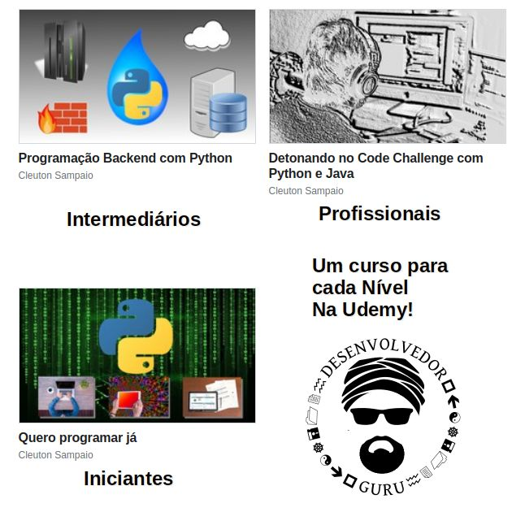

# Desenvolvedor Guru

Aproveite e conheça os meus cursos na [**Udemy**](https://www.udemy.com/user/cleutonsampaio/):

A moderna Gestão de Configuração de Software visa preservar as versões do seu produto de software e documentar as suas modificações, permitindo controlar o seu Ciclo de Vida de forma holística. 

Precisamos acompanhar as mudanças e elas precisam ser registradas de forma automática e segura em nossa base de configuração. Aí é que entra o Change Log automático. 

Veja [**a íntegra deste artigo e o vídeo no DESENVOLVEDOR.GURU**](http://www.desenvolvedor.guru/2021/11/gcs-profissional-com-comitlint-e.html)